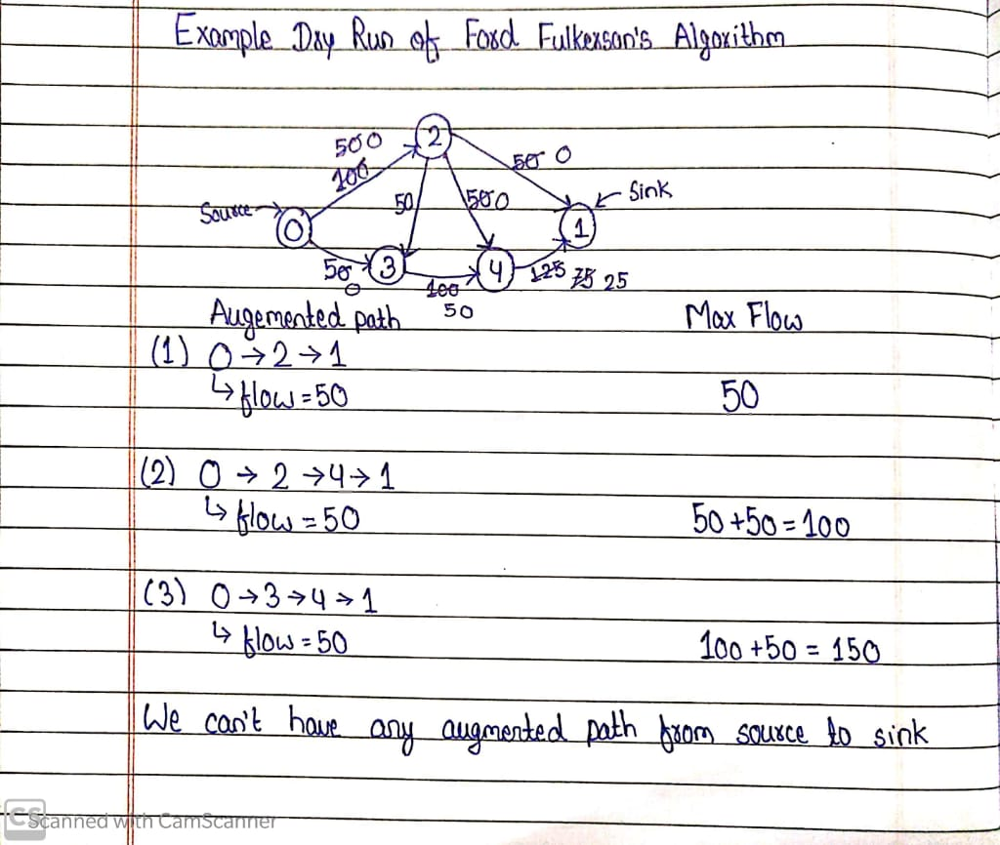

# Network Flow

## Ford Fulkerson's Algorithm
    Algorithm:
      i. Setup our directed residual graph with edge capacity as original graph weight.
      ii. Initialise a variable max_flow=0
      iii. while(there exist any augmented path from source to sink)
      {
          1. Find ‘f’,the minimum edge weight along the current path.
          2. Decrease the capacity of all the forward edges by f.
          3. Increase the capacity of all the backward edges by f.
          4. max_flow+=f
      }
      iv. print(max_flow)
      
## Dry Run of Ford Fulkerson's Algorithm
 

## Min Cut Problem
    So to find the minimum cut in the flow network we will use Ford Fulkerson’s Algorithm.
    1. Run the ford algorithm and calculate the final residual graph
    2. Find the set of vertices that are reachable from the source. So all the vertices that will be  
    reachable directly from the source will belong to the S-Component in which the source is present.
    3. All the edge which are from a reachable vertex to a non-reachable vertex are inside minimum   
    cut edge. We will print all such edges. Non reachable vertices are those vertices which belong to 
    sink component.
    
    Capacity of minimum cut is amount of maximum flow.
      
